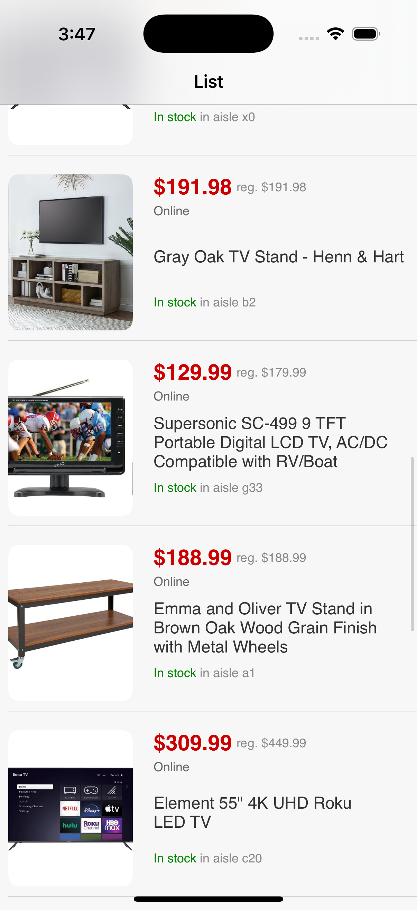
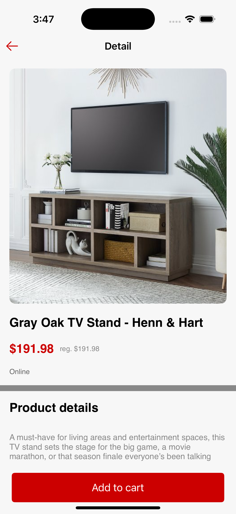

# 🎯 Target iOS Case Study

This is a reimagined iOS application based on a legacy proof-of-concept project initially created to explore Target's mobile deals experience. The app has been rebuilt to be a scalable, production-ready showcase of Target's current deals, with a modern architecture and polished UI.

## 📱 Features

- Displays a list of active Target deals fetched from a remote API.
- Tappable deal items navigate to a detail screen with expanded deal information.
- Matches the provided design mocks in layout, font, and color as closely as possible.
- Fully built using UIKit for the list screen as per requirement, and extensible to include SwiftUI in the future.

## 🛠 Architecture & Approach

This project is built with an emphasis on:

- **Clean architecture** using separation of concerns (View, ViewModel, Network, Model)
- **Testability** via dependency injection and mockable components
- **Scalability** for feature expansion and codebase growth
- **Reusability** of UI components and services
- **Robust networking** layer with error handling and fallback logic
- **Responsiveness** across different device sizes

## 📡 API Integration

Live deal data is fetched from Target’s public API:

- **Deals List Endpoint**  
  `https://api.target.com/mobile_case_study_deals/v1/deals`

- **Deal Details Endpoint**  
  `https://api.target.com/mobile_case_study_deals/v1/deals/{productId}`  
  Example: [`https://api.target.com/mobile_case_study_deals/v1/deals/1`](https://api.target.com/mobile_case_study_deals/v1/deals/1)

## 🎨 UI/UX

Follows the [Target case study Figma mockups](https://www.figma.com/file/bJmbkTubmeeQCpD9c0RgjZ/iOS-Technical-Screener), including:

- Consistent typography and spacing
- Clean card-based layout for deals
- Button styling and asset usage aligned with Target branding

## 📷 Screenshots

| Deals List | Deal Detail |
|------------|-------------|
|  |  |

## ⚙️ Technologies Used

- **UIKit** – Core UI implementation
- **URLSession** – Networking
- **Codable** – Model decoding
- **Programmatic UI** – No Storyboards
- **Auto Layout** – Responsive sizing
- **Image Caching** – Custom caching logic or third-party if used

## 🧪 Testing

- Unit tests for networking and parsing logic
- UI-level validations for layout integrity

## ✅ Requirements Covered

- ✅ Redesigned list view matching the mock
- ✅ Detail view upon tapping an item
- ✅ API integration using both endpoints
- ✅ UIKit implementation for list screen
- ✅ Clean, testable, maintainable code

## 💡 Engineering Focus Areas

- 🔸 **Clean Code**: Small, focused classes and methods
- 🔸 **Modern Patterns**: Programmatic views, MVVM-lite
- 🔸 **Networking**: Abstracted client with error handling
- 🔸 **Error Resilience**: Graceful fallback and UI recovery
- 🔸 **Scalability**: Easily extendable architecture
- 🔸 **Accessibility**: Dynamic type and semantic UI elements

## 📝 Notes

- The app does not use storyboards.
- Auto Layout is fully respected for responsiveness.

## 🧑‍💻 Author

Gourav Kumar
